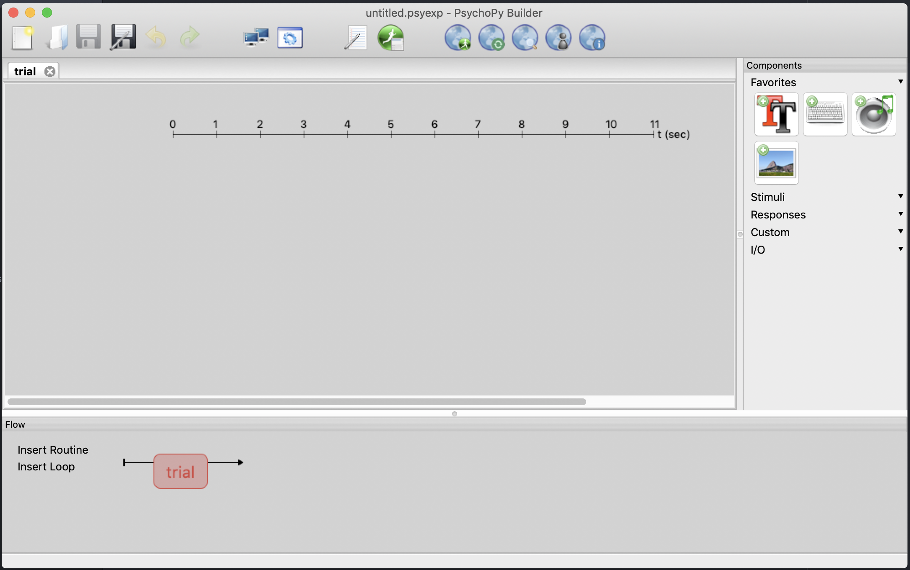
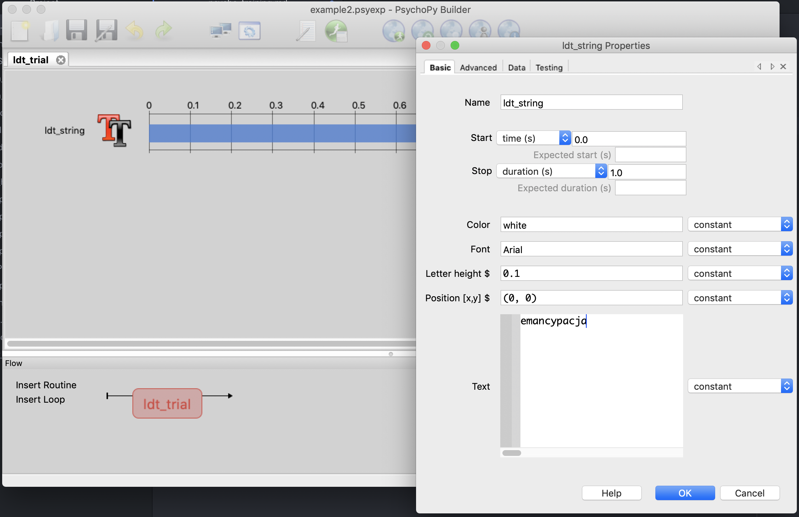
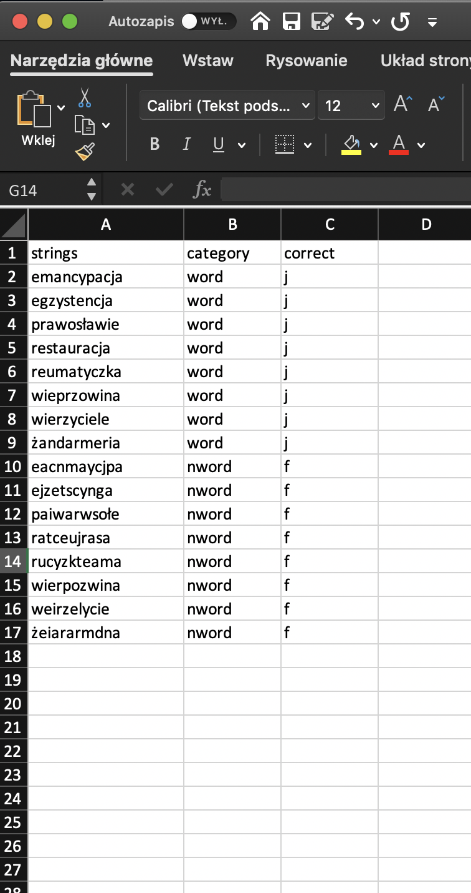
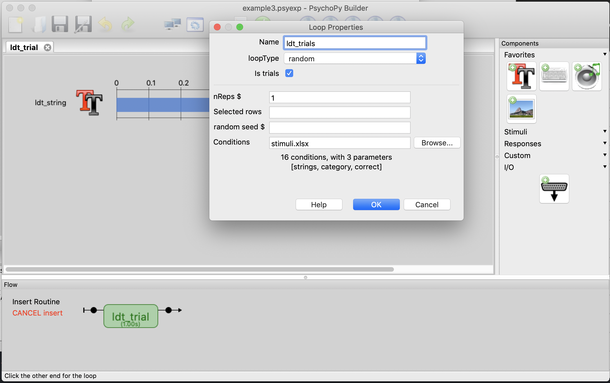
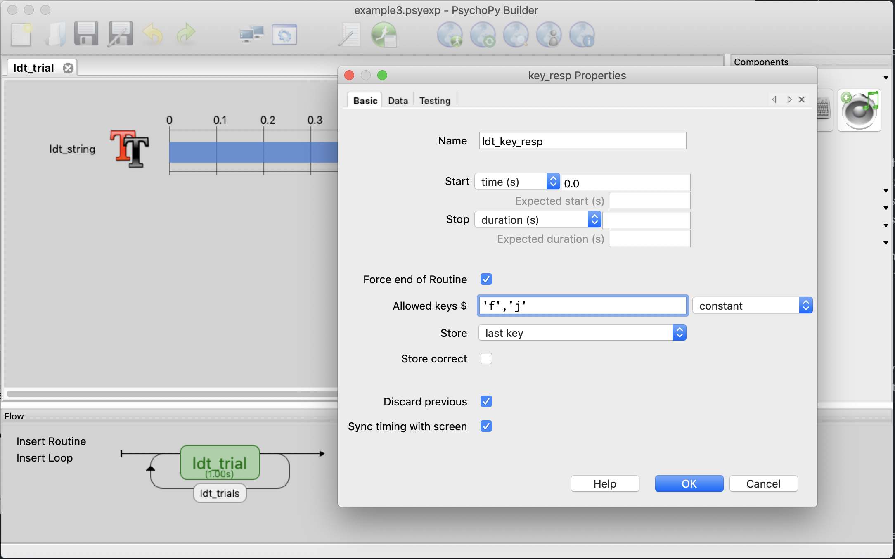
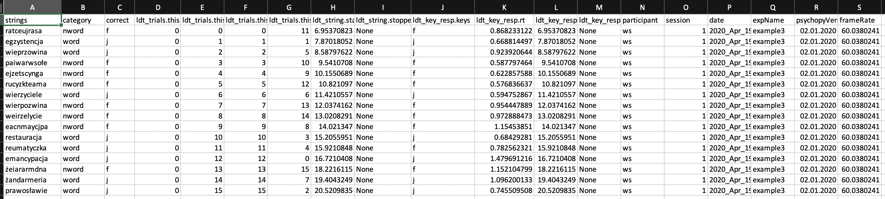
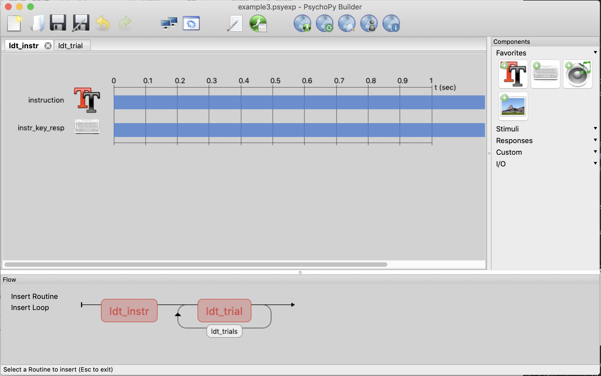
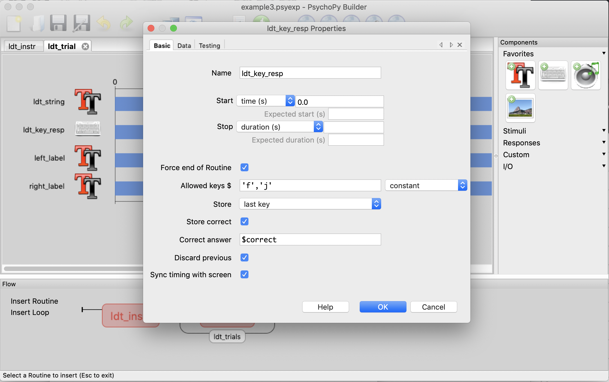
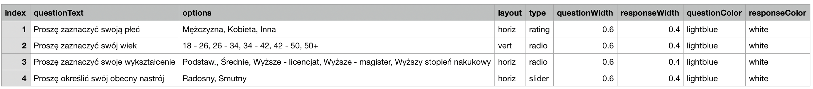

# 0. Introduction to PsychoPy

During this course, you will be expected to prepare a simple experimental script in PsychoPy.
In this class, you will learn the basics of PsychoPy: free, open-source, cross-platform package allowing you to run experiments both in the lab and online.

PsychoPy is an alternative to:
- E-Prime - but PsychoPy is free to use and does not require hardware keys to run experiments
- Qualtrics - but PsychoPy is free to use and can run reaction time studies
- jsPsych (or any other JavaScript library) - but PsychoPy - although it is based on Python - require none to minimal programming skills

Install the latest version of PsychoPy through [this link](https://www.psychopy.org).

After running PsychoPy you should see the builder view like this:

*If you don't see this window click View (from the Menu Bar at the top) and then Go to Builder View.*

In the Builder view there are 4 components:
- *Task Bar* at the top - allows you to quickly open and save experiments, set preferences of the current experiment, run experiments offline, and set the experiments online.
- *Routine* section in the center - here you design how to place components within each Routine
- *Components* section on the right - here you can select which components (stimuli, response recorders, etc.) to include in the Routine
- *Flow* section - here you design how routines are placed in your experiment

If you find all this hard to understand, don't worry! It will become easier with examples.

You have to understand that designing an experiment is like designing a movie:
There are different scenes (Routines) that include different actors and requisites (Components). You edit the sequence of scenes by pasting them into the movie plot (Flow).


# 1. Hello, world!

Let's start with something extremely simple. We will design an experiment where we will display the word 'emancypacja' to a participant.

In the *Components* section, left-click on the square with double T's to include text stimuli.

A new window will appear. First, let's give this new component a unique name. Enter 'ldt_string' in a field *Name*.

Now let's enter our word to display in the field *Text*: 'emancypacja'.

Click OK. A new component is now included in the *Routine* section.

If you want to modify this component, just left-click on the component name in the *Routine* section. Your screen should look similar to this.



Additionally, let's give a unique name to our routine. In the *Flow*, right-click on the red box named *trial*. Select *Rename* and enter a new name 'ldt_trial'.

Now, you can click on a green button in the taskbar (with a running figure), to run the experiment.

You will be asked to save your script. Create a new directory and select the script within it.

Then a *Runner view* will pop-out. Select your experiment and click on the green button with a running figure. Before starting you will have to enter a participant ID; you can put here anything you like (e.g., test_run).

Congratulations! You have created your first PsychoPy experiment!

If everything worked properly, the word 'emancypacja' was presented on a screen for 1 second and then the experiment ended.

# 2. Using loops.

In reaction times studies you will usually present more than 1 stimulus to each participant. For example, you would like to present 16 different strings consisting of 8 words and 8 non-words. How to do it in PsychoPy?

You could think about creating a new routine for each new stimulus, but this is a big mistake. Instead, you have to use a *Loop*.

First, you have to prepare a spreadsheet that includes a list of stimuli. It can have .xlsx or .csv format. If you have MS Office installed then the first option would be more convenient.

I have prepared such a spreadsheet for you (_stimuli.xlsx_). Let's look at it.



The spreadsheet should include a list of stimuli in a column. The column should also have its header with a column name. Here you can see a column named 'strings' with 16 different words or non-words. There are also additional columns that will be used later, but right now they are not necessary.

Put the file with stimuli into the same directory as your experiment file.

Now in the *Builder view*, click *Insert Loop* in the *Flow* section. Hover your mouse on the timeline before the *ldt_trial* box and a black dot will appear. When you click on it a new window will pop-out.



Enter a unique name for a new loop: 'ldt_trials'.

Click *Browse...* and select the _stimuli.xlsx_ file from the dialog box.

Currently, your experiment would present all 16 strings, 5 times each, 80 times in total. This is perhaps too much. Change the number of repetitions (*nReps $*) to 1. Click OK.

Now your experiment will run 16 times, but it will still present only the initial word 'emancypacja'. How to make it present stimuli from the list?

Left-click on *ldt_string* in *Routine* section. Then in the field *Text* replace the word 'emancypacja' with '$strings*' (do not use parentheses).

Why '$strings'? Recall that the column name in the spreadsheet is *strings*. So, you have to point PsychoPy to this column as the list of stimuli. However, you cannot simply put 'strings', because PsychoPy will not now whether you want to present the content of the list named *strings* or a word 'strings'. Thus, you have to use a prefix *$* to tell PsychoPy to look for a list named *strings*.

Additionally, in the drop-down list next to the *Text* field change the value from 'Constant' to 'Set every repeat'. With every iteration of the loop, PsychoPy will draw an element from the list and present it as a text stimulus. Click OK.

Save your changes and now you are ready to run your updated experiment.

A list of 16 strings will be presented on the screen, each for 1 second. Note that by default PsychoPy presents your stimuli in random order. You can change this behavior in the loop properties (via *loopType*).

# 3. Recording responses

In a typical experiment, you would expect that participants will provide some input, which will be recorded and then analyzed. For example, you can ask participants to press one keyboard key when a word is presented and to press another key when a non-word is presented. Let's add such functionality in our experiment.

In the *Components* section find a *Keyboard* component and click on it. Your screen should like this.



Enter a unique name for this response recorder: 'ldt_key_resp'.

Now let's define *Allowed keys*. Suppose that within each trial participants will have to select one of two keyboard keys: F (in case of a non-word) and J (in case of a word). Let's enter these allowed keys as: 'f', 'j'.

Note several settings:
- *Start time (s)* - this is set to 0.0. Responding is allowed from time 0.0 of the trial. If you want to postpone responding (e.g., only after the first second of the trial), adjust this value appropriately.
- *Stop (duration)* is set to blank - this means that PsychoPy will wait indefinitely for a participant's response. If you want to have a timed response (e.g., up to 2 seconds for each stimulus), put an appropriate value here.
- *Force end of Routine* - pressing an allowed key will stop the trial and move the participant to the next routine. You can unmark this option if you want to design a different scenario.
- *Store* - only the last key pressed by a participant will be stored in the database. You can change this option if something else is required.
- *Allowed keys* - Note the *$* sign. This means that you can define allowed keys in a separate column of your stimuli spreadsheet. For example, if you want to wait until a correct key is pressed and the correct key is different for each stimulus, then you could define allowed keys with this option.

Click OK. Note that your routine has now 2 components. *ldt_string* is displayed for 1 second and *ldt_key_resp* is active indefinitely. This means that a string will be presented for 1 second, then it will disappear, and PsychoPy will wait for a response. Once F or J is pressed it will move the participant to the next trial. You can try it if you want to.

One drawback of this setting is that under some circumstances, it can become a little chaotic for our participants. Let's change the properties of *ldt_string* to be displayed indefinitely (until the response is given). Click on *ldt_string* in the Routine view. Erase the value of the field *Stop (duration)* (i.e., it should be blank) and click OK.

Save your progress. Now you can run your lexical decision task. When you finish the procedure you can look at your responses. These are saved within a subdirectory 'data', as a .csv file. There should be plenty of files here (from each of the previous run of your experiment), choose the most recent .csv file. You can open it, for example, with MS Excel.



You will see responses for each trial of the experiment. The columns 'ldt_resp.keys' and 'ldt_resp.rt' contain a pressed key and a response latency, respectively. Later, you would like to process these values in statistical analysis.   

# 4. Additional fixes and adding instructions.

The version of LDT that we created so far is rather hard to grasp for participants. Let's make a little bit easier to use.

First, let's add labels that will remind participants which key to press for words and non-words.

Add a new text stimulus. Name it as 'left_label' and set 'f - nie-słowo' as a text. Now you have to adjust the position of this label (in the field *Position [x,y] $*), otherwise it will overlap with our stimuli. The coordinates x and y represent the horizontal and vertical position, respectively, with 0 as the center of the screen. Lets set these values to: (-0.53, 0.45), i.e., move to the left and the top of the screen. Finding the proper values usually require several attempts. Additionally, set the value of *Stop (duration)* to a blank (the label will be displayed until the trial ends). Click OK.

Now repeat these steps to add the 'right_label', with a text 'j - słowo'. Set the position to: (0.59, 0.45), i.e., top right. Remember about setting *Stop (duration)* to blank. Click OK.

Finally, let's add an instructions block. We will need to create a new routine. In the *Menu Bar*, click on *Experiment* and then *New Routine*. You will be asked to provide a unique name. Lets choose 'ldt_instr'.

In the *Routine* section, a new card will appear, change the card to the newly created.

In the new routine, create a new text component named 'instruction'. Put instructions in a text field. You can use these:

```
Na ekranie będą pojawiać się ciągi liter.

Wciśnij F gdy na ekranie pojawi się ciąg niebędący słowem.
Wciśnij J gdy na ekranie pojawi się ciąg będący słowem.

Połóż palce wskazujące obu rąk na klawiszach F i J.
Następnie wciśnij spację, aby rozpocząć.
```

Adjust a field *Letter height* to a slightly smaller value, e.g. 0.06. Make the duration indefinite and click OK.

Now, we need to provide some way to start the experiment after a participant read the instruction.

Add a keyboard response recorder. Name it as 'instr_key_resp', change the duration to indefinite (blank), and set *Allowed keys* to: 'space'. Thus the LDT will start when a participant hits space.

Finally, we have to add the newly created routine to the experiment flow. In the *Flow* section, click *Insert Routine*, select 'ldt_instr', and place the instructions before the 'ldt_trials' loop.

Your screen should look similar to this:



As usual, you can save your progress, and run the experiment to see whether everything works properly.

# 5. Providing feedback.

Let's add more features to our experiment. Suppose we would like to feedback to our LDT so that after each trial participant will be informed whether a response was correct or not.

First, we need to inform PsychoPy which keys are correct and which not. Such information is provided in our stimuli spreadsheet in the column 'correct'. Thus, in the case of words, the correct answer is 'j', whereas in the case of non-words the correct answer is 'f'. Go to the routine *ldt_trial*, click on *ldt_key_resp* mark the option *Store correct*. A new field will appear. You have to put here a list of correct responses: $correct. Your screen should look like this:



Click OK.

Now, create a new routine and name it as 'ldt_feedback'. Within this routine create a new text stimulus and name it as 'feedback_text'. Set the value of text to $feed_text, and make sure the value in the drop-down list next to the field is set to 'set every repeat'. Leave the duration of this stimulus to its default value (1 second).

Now, PsychoPy will display the value of *$feed_text*, but where is this variable located? We need to create with a little help from Python.

In the *Components* section, find a *Code* component (under drop-down list named *Custom*), and add it to the routine. Name the new code component as 'feed_code'.

Now, below different cards are used for including a custom code in different sections of the entire script.

Put this code in the section *Begin Experiment*:
```
feed_text = ""
```
Put this code in the section *Begin Routine*
```
if ldt_key_resp.corr:
    feedback_text.color = "green"
    feed_text = "dobrze"
else:
    feedback_text.color = "red"
    feed_text = "źle"
```
In other words, we first defined a new parameter *feed_text*, and then we set its value to either "dobrze" or "źle" depending on whether participant responded correctly or not in the previous trial. Additional lines are used to set the font color depnding on the feedback.

There are 2 additional things to do: 1) You have to move the code component above every other stimulus within this Routine. Right-click on *feed_code* and select *move to top* from the dropdown list. 2) In the Flow section, insert the *ldt_feedback* after *ldt_trial*, but within the *ldt_trials* loop.

Save your progress, and run the experiment to check whether everything works properly.

# 6. Survey forms.

One last skill that you may find useful is creating survey forms in PsychoPy. The initial version of PsychoPy was not designed to support survey questions. However, recent versions brought a significant update and PsychoPy now supports the most common survey question types. Still creating surveys in PsychoPy requires a little bit more effort than, for example, making surveys in Qualtrics.

First, survey questions are included in a form. Every question in a form has to be defined in a spreadsheet (with a predefined template). See the template below:



- *index* - questions need to be indexed by a sequence of values
- *questionText* - the content of the questions
- *options* - options that participant can choose
- *layout* - whether options should be laid out in a horizontal (horiz) or vertical (vert) manner
- *type* - a type of survey question: rating, radio, slider
- *questionWidth*, *responseWidth* - what proportion of the form question and options should take
- *questionColor*, *responseColor* - which font color to use in the case of either question and responses

I have provided a sample template for demographic questions in a file: demografia2.xlsx. Make sure to put it in the same directory as the experiment script.

To include demographic questions, create a new routine named 'demographics'. Add a Form component to the newly created routine (you can find it under the Responses list).

A new window will pop-out. Name the component as 'demo'. In the field items enter: 'demografia2.xlsx'. Also, adjust the value of *Text height* slightly to 0.02. Click OK.

The form should now work, but it needs some way of moving forward to further parts of the experiment. The simplest way is by including keyboard response (in a similar way as with the instructions screen - *ldt_instr* routine). Make sure to include such an option before finishing your script. Don't forget about proper instruction for participants, how they should move forward.


# What to do next!

Once you finish your script send it to me: wiktor.soral@psych.uw.edu.pl (to obtain 'pass').

Make sure to look through other examples of PsychoPy scripts (in the *Demos* section).

Consult with your group members, which part of your project could be implemented in PsychoPy.

Prepare with the rest of your group the PsychoPy script that could be used as part of your project.

Send the all the files to me by May 4th, 2020.

In case of questions or technical issues, you can write to me and we can arrange a smaller video meeting.
